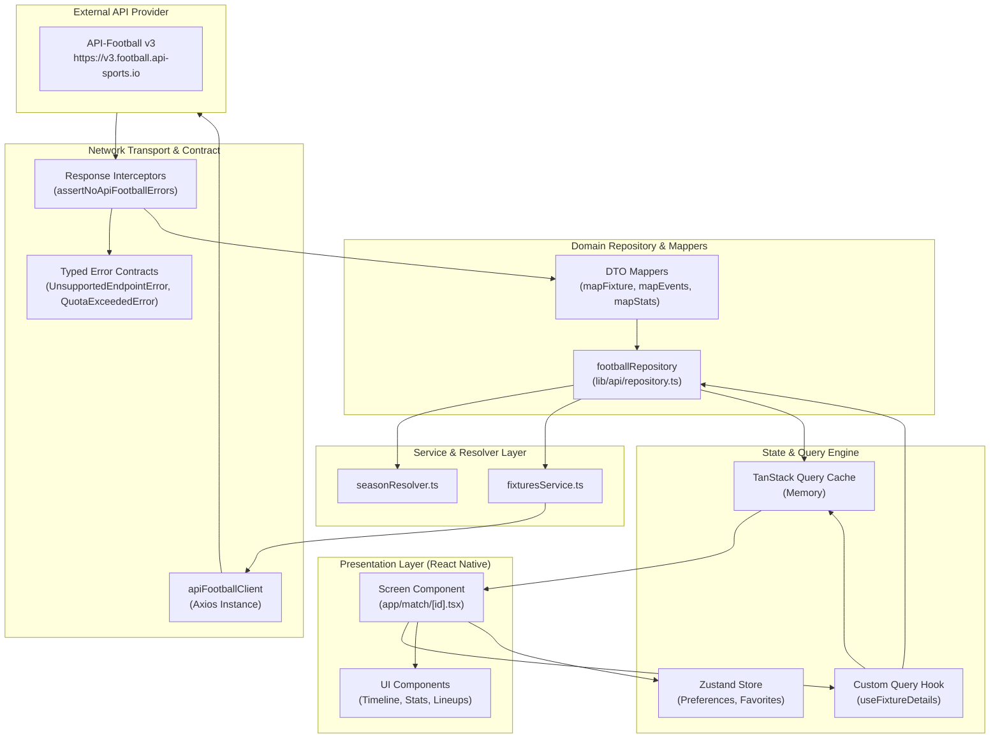

# MatchPulse

<div align="center">


-3DDC84?style=for-the-badge&logo=android&logoColor=white)
> License: Not specified

<p align="center">
  <strong>Live football data, match insights, teams, players, leagues, and more — in a focused mobile experience.</strong>
</p>

</div>

---

MatchPulse is a modern, high-performance mobile football companion application engineered with React Native 0.81, Expo SDK 54, and TypeScript. Designed for football enthusiasts who demand speed and depth, MatchPulse provides real-time live scores, comprehensive fixture schedules, granular match details, squad listings, full player profiles with seasonal statistics, league standings tables, personal favorites, local kickoff reminders, and football news. Built on an offline-first architecture with persistent TanStack React Query caching via AsyncStorage, the application instantly hydrates cached data on cold launch and handles network transitions gracefully, delivering a resilient and responsive user experience even in poor network conditions.

---

## Table of Contents

- [Features](#features)
  - [1. Live Match Centre](#1-live-match-centre)
  - [2. Comprehensive Match Details](#2-comprehensive-match-details)
  - [3. Teams & Squads](#3-teams--squads)
  - [4. Real Player Profiles & Statistics](#4-real-player-profiles--statistics)
  - [5. Leagues & Standings](#5-leagues--standings)
  - [6. Search & Discovery](#6-search--discovery)
  - [7. Favorites Management](#7-favorites-management)
  - [8. Notifications & Match Reminders](#8-notifications--match-reminders)
  - [9. Offline Support & Cache Persistence](#9-offline-support--cache-persistence)
  - [10. Data Saver Mode](#10-data-saver-mode)
  - [11. Focus-Aware Live Auto-Refresh](#11-focus-aware-live-auto-refresh)
  - [12. Football News Architecture & Provider Plan State](#12-football-news-architecture--provider-plan-state)
- [Screens & Navigation](#screens--navigation)
  - [Navigation Structure](#navigation-structure)
  - [UI & Visual System](#ui--visual-system)
- [Architecture](#architecture)
  - [Layered System Architecture](#layered-system-architecture)
  - [System Architecture & Data Flow Diagram](#system-architecture--data-flow-diagram)
  - [Offline Cache Hydration & Network Synchronization](#offline-cache-hydration--network-synchronization)
- [Tech Stack](#tech-stack)
- [Data Flow Walkthroughs](#data-flow-walkthroughs)
  - [Flow 1: Live Fixtures & Auto-Refresh](#flow-1-live-fixtures--auto-refresh)
  - [Flow 2: Match Detail Multi-Query Hydration](#flow-2-match-detail-multi-query-hydration)
  - [Flow 3: Player Profile & Dynamic Season Resolution](#flow-3-player-profile--dynamic-season-resolution)
  - [Flow 4: Offline Cold Launch & Hydration](#flow-4-offline-cold-launch--hydration)
- [API Integration & Error Contracts](#api-integration--error-contracts)
  - [API-Football v3 REST Client](#api-football-v3-rest-client)
  - [HTTP 200 Error Payload Contracts](#http-200-error-payload-contracts)
  - [Dynamic Season Resolution Engine](#dynamic-season-resolution-engine)
  - [Conservative Quota Protection](#conservative-quota-protection)
- [Environment Variables](#environment-variables)
- [Getting Started & Local Setup](#getting-started--local-setup)
  - [Prerequisites](#prerequisites)
  - [Installation](#installation)
  - [Running the Application](#running-the-application)
  - [Testing Offline Persistence via ADB](#testing-offline-persistence-via-adb)
- [Project Directory Structure](#project-directory-structure)
- [Verified Implementation State & Known Limitations](#verified-implementation-state--known-limitations)
  - [Engineering Verification Matrix](#engineering-verification-matrix)
  - [Provider Plan Constraints](#provider-plan-constraints)
- [License](#license)

---

## Features

### 1. Live Match Centre
- **Real-Time Scoreboards**: Live score updates, current match minute, and dynamic status badges (`1H`, `2H`, `HT`, `FT`, `ET`, `P`, `SUSP`, `INT`, `PST`, `CANC`).
- **Tri-State Filtering**: Seamless switching across **Live**, **Scheduled / Upcoming**, and **Finished / Recent** match lists.
- **Date Navigation**: Fast calendar-based day switcher to browse previous matchdays or preview upcoming fixtures across the calendar year.
- **Continuous Live Polling Engine**: Automatic 120-second polling while the relevant screen is focused; polling stops when the screen is unfocused or the app is backgrounded.

### 2. Comprehensive Match Details
- **Detailed Match Header**: Live score display, kickoff timestamp, referee assignment, stadium venue, city, and competition round.
- **Interactive Multi-Tab Interface**:
  - **Overview**: Recent 5-match form guide, head-to-head records, venue information, and referee metadata.
  - **Timeline / Events**: Chronological match feed featuring goals, assists, yellow/red cards, substitutions, and VAR decisions. Every player event links directly to the player's profile via verified player IDs.
  - **Statistics**: Side-by-side comparative progress bars for possession percentage, total shots, shots on target, expected goals (xG), fouls, corners, offsides, and pass accuracy.
  - **Lineups**: Starting XI formations (e.g., 4-3-3, 4-2-3-1), starting lineups with squad numbers, substitutes bench, and manager details.
  - **Predictions**: Match outcome probability distribution (Home / Draw / Away) and prediction insights where available from the provider.
- **Hybrid Data Support**: Automatically queries API-Football fixture endpoints, with graceful fallback to seeded local match data (`data/matchDetails.ts`) for offline or development fixtures.

### 3. Teams & Squads
- **Club Dossier**: Club crest, official name, country, founding year, and home stadium venue.
- **Season Fixture Schedule**: Complete team schedule and historical results filtered by supported seasons, replacing unsupported Free-tier API parameters (`last`/`next`) with verified season-based queries.
- **Roster & Squad Exploration**: Full squad categorized by role (Goalkeepers, Defenders, Midfielders, Forwards) with jersey numbers and direct navigation to Player Profiles.
- **Favorites Integration**: One-tap toggling to pin or unpin teams from the user's favorites collection.

### 4. Real Player Profiles & Statistics
- **API-Football Integration**: Direct resolution of real numeric player IDs (e.g., Onana `#545`, Mount `#19298`) retrieved from lineups, events, or squads.
- **Biographical Data**: Player headshot, age, birth date, nationality, physical measurements (height, weight), preferred position, and club jersey number.
- **Comprehensive Season Statistics**:
  - Appearances, starting lineups, total minutes played, average match rating.
  - Attacking output: Total goals, assists, penalty goals, total shots, shots on target.
  - Playmaking & Discipline: Total passes, key passes, pass accuracy %, fouls committed, yellow cards, red cards.
- **Deep-Link Navigation**: Accessible by tapping any player in Match Lineups, Match Events/Timeline, or Team Squad lists.
- **Local Fallback**: Gracefully falls back to seeded local players (`data/players.ts`) when operating with mock IDs or offline development fixtures.

### 5. Leagues & Standings
- **Major Competitions**: Browse top global competitions including Premier League (ID: 39), La Liga (ID: 140), Bundesliga (ID: 78), Serie A (ID: 135), Ligue 1 (ID: 61), UEFA Champions League (ID: 2), and FIFA World Cup (ID: 1).
- **Interactive Standings Table**: Full league tables with Rank, Club, Matches Played, Wins, Draws, Losses, Goals For/Against, Goal Difference, Points, and 5-game recent Form badges.
- **Top Scorers**: League top scorers table tracking player rankings, goals, penalties, and assists.
- **Season-Aware Queries**: Dynamically resolves league standings to the latest active season supported by the API plan.

### 6. Search & Discovery
- **Local Entity Search**: Fast, responsive search across seeded clubs, competitions, and players.
- **Recent Search History**: Persisted search query history powered by Zustand and AsyncStorage.
- **Direct Navigation**: Instantly jump from search results directly to Team, League, Player, or Match screens.
- *Note*: Search operates against locally cached and indexed entities; it does not issue arbitrary global API queries, conserving the daily request quota.

### 7. Favorites Management
- **Multi-Entity Pinning**: Pin favorite matches, teams, and leagues across the application.
- **AsyncStorage Persistence**: Stored via Zustand with persistence middleware (`matchpulse-favorites`).
- **Dedicated Favorites Filter**: Filter matches in the Matches tab to show only games featuring favorited teams or leagues.
- **Profile Hub**: Manage all saved favorites from the Profile tab with one-tap removal.

### 8. Notifications & Match Reminders
- **Local Kickoff Reminders**: Schedule match reminders directly on device using `expo-notifications`.
- **15-Minute Lead Time**: Notifications fire 15 minutes before match kickoff (`LEAD_MS = 15 * 60_000`).
- **Android Notification Channel**: Configured with high-priority channel `'matchpulse'` for reliable alert delivery.
- **In-App Notification Inbox**: Dedicated Notification Center (`app/notifications/index.tsx`) recording all triggered alerts.
- **Deep Linking**: Tapping a notification opens the app directly to the relevant Match Detail screen (`/match/[id]`).
- *Note*: Operates entirely on-device via local scheduling; does not require or communicate with an external push server.

### 9. Offline Support & Cache Persistence
- **TanStack React Query Cache Persistence**: Query state is serialized and persisted to `AsyncStorage` under the key `matchpulse-query-cache-v1`.
- **7-Day Maximum Cache Age**: Persisted data remains valid for up to 7 days (`MAX_CACHE_AGE_MS = 7 * 24 * 60 * 60_000`).
- **Selective Dehydration**: Only successfully resolved user queries are persisted (`fixtures`, `fixture`, `standings`, `team`, `squad`, `topscorers`, `player`, `search`, `news`). In-flight errors and loading states are never persisted.
- **NetInfo Synchronization**: Real-time connection detection via `@react-native-community/netinfo` syncs with TanStack Query's `onlineManager`.
- **Fast Cold Launch Hydration**: Cache hydration executes on app startup with a 1000ms safety timeout race, ensuring the UI renders immediately even when offline.
- **Stale-While-Revalidate UX**: Stale cached data is rendered instantly while fresh data refetches in the background upon network restoration.
- **Visual Offline Banners**: Displays subtle, non-intrusive offline indicators when viewing cached data without connectivity.

### 10. Data Saver Mode
- **Bandwidth Optimization**: Dedicated toggle in Settings (`usePreferencesStore`).
- **Polling Deactivation**: Disables automatic background polling timers for live match lists and active match details.
- **Stale Time Extension**: Multiplies query cache freshness thresholds to reduce API overhead:
  - Live Fixtures: 60s &rarr; 5 minutes
  - Fixtures: 10 minutes &rarr; 30 minutes
  - Match Details: 90s &rarr; 5 minutes
  - Standings: 30 minutes &rarr; 2 hours
  - News: 30 minutes &rarr; 60 minutes
- **Pull-to-Refresh Support**: Manual swipe-to-refresh remains fully operational in Data Saver mode.

### 11. Focus-Aware Live Auto-Refresh
- **Active Match Detail Polling**: Refetches every 30 seconds (`livePollMs.matchDetail = 30_000`) when a match is currently live (`1H`, `2H`, `ET`).
- **Live Match List Polling**: Refetches every 120 seconds (`livePollMs.normal = 120_000`) on Home and Matches tabs to detect newly live fixtures.
- **Focus Awareness**: Uses `@react-navigation/native`'s `useIsFocused` to pause polling timers whenever the screen or tab is not active.
- **Background Protection**: `refetchIntervalInBackground: false` halts all network polling when the user switches to another mobile app.
- **Data Saver Integration**: Automatically disabled when Data Saver mode is active.

### 12. Football News Architecture & Provider Plan State
- **Clean Architecture Implementation**: Complete end-to-end integration featuring:
  - DTO schema: `ApiNewsResponse`, `ApiNewsArticleDto` (`lib/api/dto/newsDto.ts`)
  - Domain model: `NewsArticle` (`types/football.ts`)
  - Mapper layer: `mapNewsArticle` (`lib/api/mappers/mapNews.ts`)
  - Service layer: `fetchFootballNews()` (`lib/api/services/newsService.ts`)
  - Repository layer: `footballRepository.news()` (`lib/api/repository.ts`)
  - Hook: `useFootballNews(limit)` (`hooks/useFootballNews.ts`)
  - UI: `HomeNewsSection` with `NewsCard` components (`components/home/`)
- **Graceful Error Handling**: Full UI states for loading skeletons, empty responses, network errors, and retry actions.
- **Provider Status / Limitation**:
  > [!IMPORTANT]
  > The API-Football `/news` endpoint is restricted by the provider to paid subscription tiers. Under the standard Free tier account (100 requests/day), API-Football returns an endpoint restriction / empty response. MatchPulse detects this via `UnsupportedEndpointError` / `QuotaExceededError` and renders an informative empty card (`"Football news is currently unavailable."`) with a manual retry button. MatchPulse **does not fabricate fake news** when the provider endpoint is restricted.

---

## Screens & Navigation

MatchPulse utilizes **Expo Router v6** for typed, file-based routing.

### Navigation Structure

```
app/
├── _layout.tsx                     # Root provider layout (QueryClient, Persistence, Notifications, Theme)
├── (tabs)/
│   ├── _layout.tsx                 # Custom styled bottom navigation tab bar
│   ├── index.tsx                   # Home screen (Live matches, today's games, news, shortcuts)
│   ├── matches.tsx                 # Matches screen (Live, upcoming, finished, date picker)
│   ├── leagues.tsx                 # Leagues screen (Browse major domestic & continental leagues)
│   └── profile.tsx                 # Profile & Favorites hub (Saved teams, leagues, matches)
├── match/
│   └── [id].tsx                    # Match Detail (Header, Overview, Timeline, Stats, Lineups, Predictions)
├── player/
│   └── [id].tsx                    # Player Profile (Biographical details, seasonal stats, ratings)
├── team/
│   └── [id].tsx                    # Team Detail (Club dossier, season fixtures, full squad list)
├── league/
│   └── [id].tsx                    # League Detail (Standings table, fixtures, top scorers)
├── search/
│   └── index.tsx                   # Search modal (Instant filter, recent search history)
├── settings/
│   └── index.tsx                   # Settings modal (Data Saver, live refresh, notifications, time format)
├── notifications/
│   └── index.tsx                   # In-app Notification Center (History of triggered match alerts)
└── dev/
    └── index.tsx                   # Developer diagnostics (API call history, cache metrics, plan status)
```

### UI & Visual System

MatchPulse implements a custom dark sports aesthetic defined in `theme/`:

| Token | Hex Value | Role |
| :--- | :--- | :--- |
| `background` | `#0B0D12` | Deep OLED black base canvas |
| `surface` | `#151923` | Card and component surfaces |
| `surfaceElevated` | `#1C2230` | Modals, active states, elevated dropdowns |
| `surfaceHighlight` | `#232A3A` | Highlighted borders and selected tabs |
| `primary` | `#00E676` | Neon electric pitch green accent |
| `primaryMuted` | `#0F3D2A` | Background tint for active badges |
| `live` | `#FF4D4D` | Vibrant red for live match minutes and badges |
| `textPrimary` | `#FFFFFF` | Primary headers and high-contrast typography |
| `textSecondary` | `#B0B3B8` | Subtitles, metadata, timestamps, and muted labels |
| `border` | `#343A4A` | Thin structural card and divider borders |

- **Bottom Tab Navigation**: Implemented in `app/(tabs)/_layout.tsx` featuring custom icons (`Ionicons`), active green pills, label scaling, and safe area insets.
- **Glassmorphism & Modals**: Smooth slide and fade transitions for modal sheets (`search`, `settings`, `notifications`).

---

## Architecture

MatchPulse follows a **Clean, Layered Architecture** separating presentation, state management, repository abstraction, service orchestration, and network transport.

### Layered System Architecture

```
┌────────────────────────────────────────────────────────┐
│                   Presentation Layer                   │
│   Screens (app/) & Atomic Components (components/)     │
└───────────────────────────┬────────────────────────────┘
                            │
                            ▼
┌────────────────────────────────────────────────────────┐
│                  State Management                      │
│   • Server State: TanStack React Query (hooks/)        │
│   • Client State: Zustand Stores (store/)              │
└───────────────────────────┬────────────────────────────┘
                            │
                            ▼
┌────────────────────────────────────────────────────────┐
│                  Repository Layer                      │
│   footballRepository (lib/api/repository.ts)           │
│   • Decouples UI & hooks from API transport details    │
│   • Maps DTO schemas into strict Domain Models         │
└───────────────────────────┬────────────────────────────┘
                            │
                            ▼
┌────────────────────────────────────────────────────────┐
│                   Service Layer                        │
│   • fixturesService.ts   • newsService.ts              │
│   • seasonResolver.ts    • diagnostics.ts              │
└───────────────────────────┬────────────────────────────┘
                            │
                            ▼
┌────────────────────────────────────────────────────────┐
│               Network & Contract Layer                 │
│   apiFootballClient (lib/api/client.ts)                │
│   • Axios interceptors & HTTP 200 error parsing        │
│   • Typed error taxonomy & exponential backoff         │
└───────────────────────────┬────────────────────────────┘
                            │
                            ▼
┌────────────────────────────────────────────────────────┐
│            External Provider / Storage                 │
│   • API-Football v3 REST API (remote)                  │
│   • AsyncStorage & NetInfo (local persistence)         │
└────────────────────────────────────────────────────────┘
```

### System Architecture & Data Flow Diagram



### Offline Cache Hydration & Network Synchronization

```mermaid
flowchart TD
    subgraph AppLifecycle ["App Lifecycle & Startup"]
        Boot["App Launch / Boot"]
        Hydrate["hydrateQueryClient()<br/>(Safety timeout: 1000ms)"]
        Attach["attachQueryPersistence()<br/>(App state & mutation listeners)"]
    end

    subgraph Storage ["Local Storage & Offline Engine"]
        AsyncStorage["AsyncStorage<br/>('matchpulse-query-cache-v1')"]
        PersisterFilter["shouldDehydrateQuery()<br/>(success status, allowed root keys)"]
    end

    subgraph QueryState ["TanStack Query Client"]
        ClientCache["QueryClient Cache"]
        OnlineMgr["onlineManager"]
    end

    subgraph Hardware ["Device Hardware & Connectivity"]
        NetInfo["@react-native-community/netinfo"]
    end

    Boot --> Hydrate
    Hydrate -->|Read serialized cache| AsyncStorage
    AsyncStorage -->|DehydratedState| Hydrate
    Hydrate -->|Hydrate state| ClientCache
    Boot --> Attach

    ClientCache -->|Query update/success| PersisterFilter
    PersisterFilter -->|Debounced write (1000ms)| AsyncStorage

    NetInfo -->|Network transition event| OnlineMgr
    OnlineMgr -->|Online: trigger refetch stale queries| ClientCache
```

---

## Tech Stack

| Category | Technology | Version | Purpose / Role in MatchPulse |
| :--- | :--- | :--- | :--- |
| **Runtime & Core** | **React Native** | `0.81.5` | Mobile framework with New Architecture enabled |
| **Framework** | **Expo** | `~54.0.37` | Managed developer tooling and native module ecosystem |
| **Language** | **TypeScript** | `~5.9.2` | End-to-end static type safety and contract enforcement |
| **Navigation** | **Expo Router** | `~6.0.24` | File-based, typed routing with dynamic parameters |
| **Server State** | **TanStack React Query** | `^5.101.4` | Asynchronous query caching, polling, and deduplication |
| **Client State** | **Zustand** | `^5.0.15` | Lightweight client state for favorites, preferences, and inbox |
| **Networking** | **Axios** | `^1.19.0` | HTTP client with request/response interceptors |
| **Offline Cache** | **AsyncStorage** | `2.2.0` | Serialized persistent storage for query cache and user state |
| **Connectivity** | **NetInfo** | `11.4.1` | Network reachability and online/offline event listener |
| **Notifications** | **Expo Notifications** | `~0.32.17` | Local notification scheduling and channel management |
| **Styling** | **NativeWind / Tailwind**| `^4.2.6` / `^3.4.19`| Utility-first styling synchronized with design tokens |
| **Animations** | **React Native Reanimated** | `~4.1.1` | Performant native animations for navigation and transitions |
| **Device Feedback**| **Expo Haptics** | `~15.0.8` | Haptic feedback for user interactions and toggles |
| **Icons** | **Expo Vector Icons** | `^15.1.1` | Ionicons and vector graphics across navigation and cards |
| **Data Provider** | **API-Football** | `v3 REST` | External provider for live scores, fixtures, stats, and teams |
| **Target Platform**| **Android** | `API 24+` | Primary native deployment target (OnePlus Nord, Emulators) |

---

## Data Flow Walkthroughs

### Flow 1: Live Fixtures & Auto-Refresh
```
Home / Matches Screen
  │
  ├── 1. Calls useLiveFixtures({ poll: true, focused: true })
  │
  ├── 2. Reads liveAutoRefresh and dataSaver from usePreferencesStore
  │
  ├── 3. Evaluates shouldPollLiveList():
  │      • poll === true
  │      • focused === true (via useIsFocused)
  │      • dataSaver === false
  │      • liveAutoRefresh === true
  │      &rarr; Returns 120,000ms polling interval
  │
  ├── 4. Executes footballRepository.liveMatches()
  │      &rarr; fixturesService.fetchLiveFixtures()
  │      &rarr; apiFootballClient.get('/fixtures?live=all')
  │
  ├── 5. Parses response via mapFixturesToMatches(response, { requireSupportedLeague: true })
  │
  └── 6. Updates React Query cache queryKeys.live
         &rarr; Re-renders scoreboards with live minute and status badges
```

### Flow 2: Match Detail Multi-Query Hydration
```
Match Detail Screen (app/match/[id].tsx)
  │
  ├── 1. useFixtureDetails(id) triggers parallel TanStack queries:
  │      • queryKeys.fixture(id)    &rarr; footballRepository.matchById(id)
  │      • queryKeys.events(id)     &rarr; footballRepository.matchEvents(id)
  │      • queryKeys.stats(id)      &rarr; footballRepository.matchStatistics(id)
  │      • queryKeys.lineups(id)    &rarr; footballRepository.matchLineups(id)
  │      • queryKeys.prediction(id) &rarr; footballRepository.matchPredictions(id)
  │
  ├── 2. Parallel API requests dispatched via apiFootballClient
  │      (or served instantly from dehydrated AsyncStorage cache)
  │
  ├── 3. If fixture is live:
  │      shouldPollLiveMatch() activates 30-second refetch interval
  │
  └── 4. Active tab renders:
         • Overview: Head-to-head, venue, referee
         • Timeline: Chronological events with clickable player profile links
         • Statistics: Possession, shots, xG side-by-side comparative bars
         • Lineups: Starting XI formations, tactical pitch, bench
         • Predictions: Outcome probability bars
```

### Flow 3: Player Profile & Dynamic Season Resolution
```
Tap Player in Lineup / Timeline / Squad
  │
  ├── 1. Navigates to app/player/[id].tsx with numeric playerId (e.g., 545)
  │
  ├── 2. Invokes usePlayerDetails(playerId)
  │
  ├── 3. Calls resolvePlayerSeason(playerId):
  │      • Checks account plan ceiling via getMaxAllowedSeason()
  │      • Queries fetchPlayerSeasons(playerId)
  │      • Selects newest season compatible with account plan (e.g., 2024 instead of 2026)
  │
  ├── 4. Dispatches fetchPlayer(playerId, resolvedSeason)
  │      &rarr; apiFootballClient.get(`/players?id=${playerId}&season=${season}`)
  │
  ├── 5. mapPlayerProfile(apiPlayer) transforms DTO into Player domain model
  │
  └── 6. UI displays biographical card, radar-style metrics, attacking output, and discipline
```

### Flow 4: Offline Cold Launch & Hydration
```
Cold App Launch (No Active Network Connection)
  │
  ├── 1. RootLayout initializes createQueryClient()
  │
  ├── 2. Dispatches hydrateQueryClient(queryClient) in parallel with 1000ms safety race:
  │      • Reads PERSISTENCE_KEY ('matchpulse-query-cache-v1') from AsyncStorage
  │      • Validates cache timestamp against MAX_CACHE_AGE_MS (7 days)
  │      • Hydrates dehydrated query cache into active QueryClient
  │
  ├── 3. Screen components mount:
  │      • useQuery finds cached data in memory immediately (status: 'success')
  │      • Screens render instantly with cached fixtures, standings, and profiles
  │
  ├── 4. NetInfo detects isConnected === false:
  │      • onlineManager sets online status to false
  │      • React Query suppresses background refetches
  │      • Offline banner indicates cached state
  │
  └── 5. User reconnects to Wi-Fi / Cellular:
         • NetInfo fires online event &rarr; onlineManager.setOnline(true)
         • React Query triggers refetchOnReconnect for all stale queries
         • Cache is updated in background and persisted back to AsyncStorage
```

---

## API Integration & Error Contracts

MatchPulse connects directly to the **API-Football (API-SPORTS) v3 REST API**.

### API-Football v3 REST Client

The API client (`lib/api/client.ts`) is configured with:
- **Base URL**: `https://v3.football.api-sports.io`
- **Request Timeout**: 12,000ms
- **Authentication**: `x-apisports-key` header loaded from `process.env.EXPO_PUBLIC_API_FOOTBALL_KEY`
- **Telemetry Seam**: `recordApiCall` tracks request count, methods, and endpoints for runtime dev diagnostics.

### HTTP 200 Error Payload Contracts

A known architectural challenge with API-Football is that **plan rejections, invalid parameters, and quota exhaustion return HTTP 200 OK** with error details nested inside the response body:

```json
{
  "get": "players",
  "parameters": { "id": "545", "season": "2026" },
  "errors": {
    "plan": "Free plans do not have access to this season, try from 2022 to 2024."
  },
  "results": 0,
  "response": []
}
```

MatchPulse handles this via a centralized Axios response interceptor `assertNoApiFootballErrors` (`lib/api/errors.ts`):
1. **Parses the `errors` object**: Distinguishes true empty datasets (`results: 0, errors: []`) from errors (`errors: { plan: "..." }`).
2. **Throws Typed Domain Errors**:
   - `UnsupportedEndpointError`: Thrown on plan restrictions (e.g., season limits or `/news` endpoint).
   - `QuotaExceededError`: Thrown when daily quota is exhausted (100 requests/day limit reached).
   - `ApiFootballError`: Thrown on parameter validation or server-side API errors.

### Dynamic Season Resolution Engine

To prevent hardcoded calendar years from crashing on Free API-Football accounts, MatchPulse implements dynamic season resolution (`lib/api/seasonResolver.ts`):
- **Plan Auto-Detection**: Queries `/status` on first launch to inspect subscription tier.
- **Error Learning**: Automatically parses error messages containing `"try from \d{4} to (\d{4})"` to dynamically calibrate the maximum allowed season (`cachedMaxPlanSeason = 2024`).
- **Resource Season Resolution**: Before querying leagues, teams, or players, the resolver cross-references available seasons with the account plan ceiling to pick the latest accessible season.

### Conservative Quota Protection

To maximize the Free plan's 100 requests/day limit:
- **Smart Query Retries**: `shouldRetryQuery` suppresses retries on `UnsupportedEndpointError`, `QuotaExceededError`, 403, and 404 responses. Retries are restricted strictly to transient network timeouts or 5xx server errors with exponential backoff.
- **Long Cache Lifetimes**: Live data is cached for 60s (5m in Data Saver); non-live fixtures for 10m (30m in Data Saver); standings for 30m (2h in Data Saver); player profiles for 12 hours.

---

## Environment Variables

MatchPulse reads its API key at runtime through Expo's public environment variable mechanism.

### Configuration (`.env`)

Copy the example configuration to create your local `.env`:

```bash
cp .env.example .env
```

Define your API-Football key in `.env`:

```env
# Free API key from https://dashboard.api-football.com (Free plan: 100 requests/day).
# Must be prefixed with EXPO_PUBLIC_ to be inlined by Expo at build time.
EXPO_PUBLIC_API_FOOTBALL_KEY=your_actual_api_sports_key_here
```

> [!NOTE]
> `EXPO_PUBLIC_` variables are inlined into the client bundle at build time. The API client is architected behind the `footballRepository` interface, allowing a future secure backend proxy to replace direct client requests without altering any screen or component logic.

---

## Getting Started & Local Setup

### Prerequisites

- **Node.js**: `v18.0.0` or higher (tested on Node `v22.13.1`)
- **Package Manager**: `npm` (v9+) or `yarn`
- **Expo CLI**: Bundled with `npx expo`
- **Android Environment**:
  - Android Studio with Android SDK (API 24+)
  - A physical Android device with USB debugging enabled OR an Android Virtual Device (AVD)

### Installation

1. **Clone the repository**:
   ```bash
   git clone https://github.com/Pratham-M12/MatchPulse.git
   cd matchpulse
   ```

2. **Install project dependencies**:
   ```bash
   npm install
   ```

3. **Configure environment variables**:
   ```bash
   cp .env.example .env
   # Add your EXPO_PUBLIC_API_FOOTBALL_KEY to .env
   ```

4. **Verify TypeScript compilation**:
   ```bash
   npm run typecheck
   ```

### Running the Application

1. **Start the Metro Bundler**:
   ```bash
   npm start
   ```

2. **Launch on Android**:
   ```bash
   npm run android
   ```

### Testing Offline Persistence via ADB

To test offline cache hydration on a connected physical Android device or emulator:

1. **Populate Cache**: Launch the app with internet access and browse Home, Matches, and a Match Detail screen.
2. **Disable Connectivity**:
   ```bash
   adb shell svc data disable
   adb shell svc wifi disable
   ```
3. **Restart the Application**:
   ```bash
   adb shell am force-stop com.anonymous.matchpulse
   adb shell am start -n com.anonymous.matchpulse/.MainActivity
   ```
4. **Observe Offline Hydration**: The app launches immediately, restores all previously viewed fixtures from `AsyncStorage`, and displays offline status indicators.
5. **Re-Enable Connectivity**:
   ```bash
   adb shell svc data enable
   adb shell svc wifi enable
   ```
6. **Observe Automatic Sync**: React Query detects network recovery and updates stale queries in the background.

---

## Project Directory Structure

```
matchpulse/
├── app/                            # Expo Router file-based route hierarchy
│   ├── (tabs)/                     # Main bottom tab screens
│   │   ├── _layout.tsx             # Custom styled tab navigation bar
│   │   ├── index.tsx               # Home tab (Live fixtures, news, shortcuts)
│   │   ├── matches.tsx             # Matches tab (Tri-state filter, date picker)
│   │   ├── leagues.tsx             # Leagues tab (Competitions catalog)
│   │   └── profile.tsx             # Profile tab (Saved favorites, preferences)
│   ├── match/[id].tsx              # Match Detail screen (Multi-tab fixture centre)
│   ├── player/[id].tsx             # Player Profile screen (Stats, biographical info)
│   ├── team/[id].tsx               # Team Profile screen (Roster, season schedule)
│   ├── league/[id].tsx             # League Detail screen (Standings table, top scorers)
│   ├── search/index.tsx            # Search modal & query history
│   ├── settings/index.tsx          # Settings screen (Data Saver, polling controls)
│   ├── notifications/index.tsx     # In-app notification center history
│   ├── dev/index.tsx               # Dev diagnostics & telemetry
│   └── _layout.tsx                 # Root layout, QueryClient, and offline hydration
├── components/                     # Modular presentation components
│   ├── entity/                     # Reusable team and league presentation cards
│   ├── home/                       # HomeHeader, MatchList, NewsSection, NewsCard
│   ├── layout/                     # ScreenContainer, Header, OfflineBanner
│   ├── league/                     # StandingsTable, LeagueCard
│   ├── match/                      # MatchCard, MatchHeader, MatchTimeline, MatchStats
│   ├── navigation/                 # TabBarIcon, BackButton
│   ├── profile/                    # FavoritesList, SettingsItem
│   └── ui/                         # Badge, Button, ErrorState, EmptyState, Typography
├── data/                           # Seeded local data for offline development
│   ├── competitions.ts             # Supported competitions seed list
│   ├── matchDetails.ts             # Comprehensive mock match details fallback
│   ├── matches.ts                  # Mock live and scheduled matches
│   ├── players.ts                  # Mock player profiles
│   └── teams.ts                    # Seeded team profiles
├── hooks/                          # Custom TanStack React Query hooks
│   ├── useFixtureDetails.ts        # Parallel fixture overview, timeline, stats, lineups
│   ├── useFootballNews.ts          # News query hook with error contract handling
│   ├── useLiveFixtures.ts          # Focus-aware live matches polling
│   ├── usePlayerDetails.ts         # Season-aware real player profile query
│   ├── useStandings.ts             # League table standings query
│   └── useTeamDetails.ts           # Team profile, squad, and season fixtures
├── lib/
│   ├── api/                        # Network transport, repository, and services
│   │   ├── client.ts               # Axios instance with interceptors and error assertions
│   │   ├── currentSeason.ts        # Fallback season derivation
│   │   ├── diagnostics.ts          # Request logging and call counter
│   │   ├── errors.ts               # Error taxonomy and retry policy
│   │   ├── leagueIds.ts            # Mapping between internal and API-Football league IDs
│   │   ├── queryConfig.ts          # Centralized cache timings, stale times, and poll logic
│   │   ├── queryKeys.ts            # Centralized query key factory
│   │   ├── repository.ts           # Domain-facing football repository
│   │   ├── seasonResolver.ts       # Dynamic season resolution and plan detection
│   │   ├── dto/                    # API-Football JSON schema interfaces
│   │   ├── mappers/                # Transform DTOs into domain models
│   │   └── services/               # Specialized API service modules
│   ├── format/                     # Date, time, and score formatting utilities
│   ├── notifications/              # Local notification handler and reminder scheduling
│   ├── query/                      # React Query client, persistence, and NetInfo sync
│   └── storage/                    # AsyncStorage wrapper for Zustand middleware
├── store/                          # Zustand client-state stores
│   ├── useFavoritesStore.ts        # Pinned teams, leagues, and matches
│   ├── useInboxStore.ts            # Notification history records
│   ├── usePreferencesStore.ts      # Data Saver, polling toggles, time formats
│   ├── useRemindersStore.ts        # Scheduled match kickoff reminders
│   └── useSearchHistoryStore.ts    # Recent search queries
├── theme/                          # Unified design system tokens
│   ├── colors.js                   # Color palette (single source of truth)
│   ├── radius.js                   # Border radius tokens
│   ├── spacing.js                  # Spacing and layout tokens
│   ├── typography.js               # Font weights and sizes
│   └── index.ts                    # TypeScript theme re-exports
├── types/
│   └── football.ts                 # Domain models (Match, Team, Player, Competition)
├── app.json                        # Expo application manifest
├── package.json                    # Project dependencies and npm scripts
└── tsconfig.json                   # TypeScript configuration
```

---

## Verified Implementation State & Known Limitations

### Engineering Verification Matrix

| Area / Feature | Status | Verification Detail |
| :--- | :---: | :--- |
| **API Error Contract (P2)** | Verified | Distinguishes HTTP 200 error payloads from empty results; parses `errors.plan` and `errors.requests`. |
| **Team Season Fixtures (P2)**| Verified | Removed unsupported Free-plan `last`/`next` parameters; queries valid season schedules. |
| **Real Player Profiles (P3)** | Verified | Lineups, events, and squads navigate to `/player/[id]` with real API IDs (e.g. Onana `#545`). |
| **Dynamic Season Resolver (P4)**| Verified | Auto-detects Free-plan season boundary (2024); prevents crashes caused by default calendar year. |
| **Live Match Polling (P5)** | Verified | 30s detail polling, 120s empty-list discovery polling; focus-aware, halts on background. |
| **Offline Persistence (P6)** | Verified | React Query cache persisted to `AsyncStorage`; cold launch hydrates in <1s; verified via ADB. |
| **Football News Engine (P7)** | Verified | Full architecture (DTO, mapper, service, repo, hook, UI); graceful empty/retry state on Free tier. |

### Provider Plan Constraints

MatchPulse is fully configured to operate under API-Football's **Free Tier Plan**. The following boundaries are enforced by the provider:

1. **Daily Request Quota**: Limited to **100 requests/day**. MatchPulse manages this via aggressive cache durations (up to 12 hours for static entities) and smart retry suppression.
2. **Season Limitations**: Free accounts do not have access to real-time 2025/2026 season data on certain endpoints. The dynamic season resolver automatically falls back to the most recent accessible season (e.g., 2024) to keep player profiles and standings operational.
3. **News Endpoint (`/news`)**: Restricted by API-Football to paid tiers. MatchPulse includes the complete architectural implementation and displays a clean, graceful fallback state on Free tier accounts.

---

## License

No license has been specified for this project yet.
